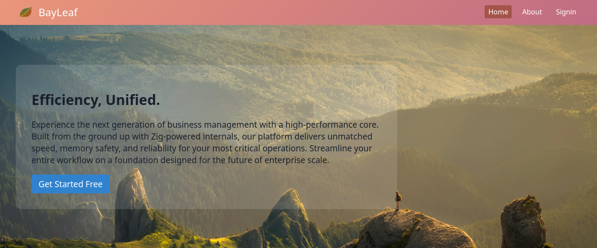

<div align="center">
  
  
  # Bayleaf
</div>

> ### **Note**
> **Currently in active development and not ready for production.** <br>
> lightning-fast enterprise resource planning — simple by design.

BayLeaf delivers a streamlined approach to business management, combining enterprise-grade functionality with a clean, intuitive interface. Designed for small to medium-sized businesses, it offers essential ERP capabilities without the bloat and complexity of traditional systems.



> Prerequisites: [Zig (v0.16)](https://ziglang.org/) installed on your system

### Installation


```bash
# To build the server according to your OS
zig build

# small binary (without debug)
zig build -Doptimize=ReleaseSmall

# Start server (Run from the zig-out/bin/ folder)
./bayleaf 
```


## License
Published under the MIT license. Built by [Joana Kelly](https://github.com/fullstackDev0404) & [Sadik Ahsan](https://github.com/sadikahasan6)
<br> <br>
<a href="https://github.com/sadikahasan6/BayLeaf/graphs/contributors">
  
</a>
